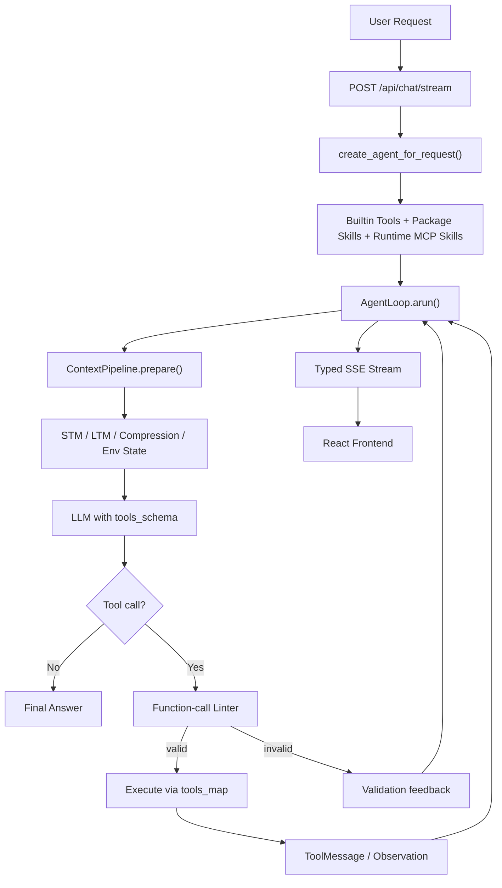
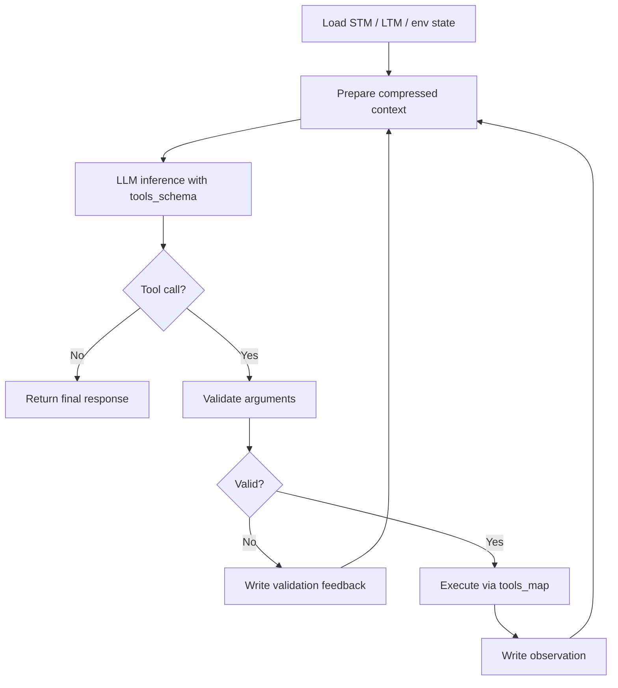
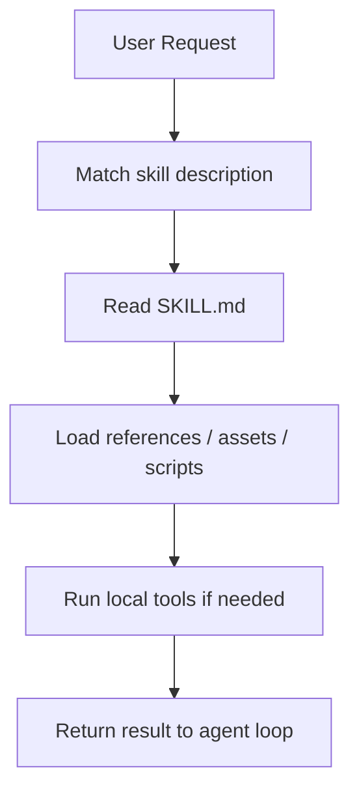
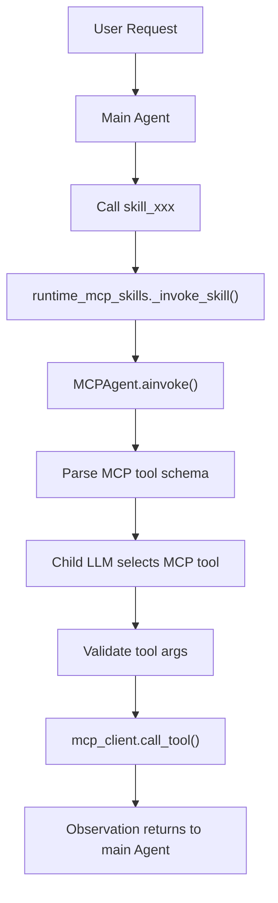

<div align="center">


<br/>

**A loop-first autonomous agent framework with MCP, Skills,**
**function-call validation, memory, and streaming runtime observability.**

**一个以 Agent Loop 为核心，集成 MCP、Skill、函数调用校验、记忆系统与流式可观测性的自主 Agent 框架。**

<br/>

[](https://python.org)
[](https://fastapi.tiangolo.com)
[](https://react.dev)
[](https://typescriptlang.org)
[](https://www.langchain.com/)

<br/>

**Agent Loop | MCP Runtime | Skill System | Function Calling | SSE Trace**

</div>

---

## Overview / 项目概览

EverLoop is an engineering-focused runtime for autonomous agents. It combines a stable agent loop, context management, tool execution, MCP integration, skill orchestration, memory, and frontend runtime tracing in one project.

EverLoop 是一个面向自主 Agent 的工程化运行框架。它不是简单的聊天壳，而是围绕一个稳定的 Agent loop，将上下文管理、工具执行、MCP 接入、Skill 编排、记忆系统和前端运行时追踪整合到同一套架构中。

The core goal is to keep an agent reliable across multi-turn reasoning, tool calls, argument repair, and result synthesis.

它的核心目标是让 Agent 在多轮推理、工具调用、参数修正和结果整合过程中保持稳定，而不是只完成一次性的模型回复。

## Highlights / 核心亮点

| Area | What EverLoop provides | 中文说明 |
|---|---|---|
| Agent loop | A reusable `AgentLoop.arun()` runtime for inference, validation, tool execution, and observation write-back | 以 `AgentLoop.arun()` 为核心，把推理、校验、工具执行和 observation 写回放进同一个循环 |
| Function calling | Separate `tools_schema` for the LLM and `tools_map` for runtime execution | `tools_schema` 给模型看，`tools_map` 给运行时执行，职责分离 |
| Tool validation | Local schema validation before executing model-generated tool calls | 在真正执行工具前先做本地参数校验，降低错误调用风险 |
| MCP runtime | MCP Servers can be exposed as high-level runtime skills | MCP Server 可以被封装为主 Agent 可调用的高层 Skill |
| Skill system | Skills can package instructions, files, templates, scripts, and domain workflows | Skill 可封装说明、文件、模板、脚本和领域工作流 |
| Streaming trace | SSE events expose thinking, tool calls, observations, usage, and runtime status to the UI | 通过 SSE 将思考、工具调用、observation、token/cost 和运行状态实时展示到前端 |

---

## Showcase / 界面展示

### Workspace / 工作台

The workspace combines chat, model selection, runtime status, and the main agent interaction surface.

工作台集成了对话入口、模型选择、运行状态面板和主 Agent 交互区域，是用户发起任务和观察 Agent 运行过程的核心界面。

<div align="center">
  
</div>

### MCP Center / MCP 管理中心

The MCP center manages MCP Servers, inspects tool schemas, and connects external tool providers to the agent runtime.

MCP 管理中心用于注册和管理 MCP Server，查看服务端暴露的 tools schema，并将外部工具能力接入 EverLoop 的 Agent runtime。

<div align="center">
  
</div>

### Skill Workbench / Skill 工作台

The skill workbench manages package skills and MCP-backed skills that can be registered as agent-callable capabilities.

Skill 工作台用于管理本地能力包和 MCP-backed Skill。对主 Agent 来说，Skill 是一个可调用能力入口；对内部运行时来说，它可以继续加载文件、脚本、模板或调用 MCP 子 Agent。

<div align="center">
  
</div>

### Runtime Trace / 运行时追踪

The trace view shows loop status, tool calls, observations, and streamed runtime events.

Trace 视图展示 Agent loop 的实时状态，包括 SSE event、tool call、observation、工具结果和运行阶段，方便调试复杂任务中的每一步。

<div align="center">
  
</div>

---

## Quick Start / 快速启动

EverLoop is started through the project startup script.

EverLoop 推荐通过项目启动脚本一键启动，脚本会同时启动后端和前端：

```bash
sh start.sh
```

Default URLs / 默认地址：

```text
Frontend: http://localhost:5173
Backend:  http://127.0.0.1:8001
API docs: http://127.0.0.1:8001/docs
```

### Requirements / 环境要求

- Conda
- Python 3.10+
- Node.js 18+
- An OpenAI-compatible LLM endpoint / OpenAI-compatible 模型接口

By default, the startup script expects a conda environment named `agent`.

默认情况下，`start.sh` 会使用名为 `agent` 的 conda 环境。

Create it if needed / 如需创建环境：

```bash
conda create -n agent python=3.11
```

Use a different conda environment / 使用其他 conda 环境：

```bash
EVERLOOP_CONDA_ENV=my-env sh start.sh
```

Skip the startup LLM health check / 跳过启动时的 LLM 健康检查：

```bash
EVERLOOP_CHECK_LLM=0 sh start.sh
```

---

## Configuration / 配置

EverLoop reads model configuration from `.env`.

EverLoop 会从 `.env` 中读取模型、鉴权和数据库配置。

Example / 示例：

```env
DEFAULT_MODEL=qwen3-32b
LLM_ENDPOINT__qwen3-32b=https://your-openai-compatible-endpoint/v1/chat/completions
LLM_API_KEY__qwen3-32b=your_api_key

JWT_SECRET_KEY=change-this-secret
DATABASE_URL=sqlite+aiosqlite:///./everloop.db
```

Model names are dynamic. For each model, define:

模型名是动态的。每个模型需要配置一组 endpoint 和 API key：

```text
LLM_ENDPOINT__<model_name>
LLM_API_KEY__<model_name>
```

Then set / 然后设置默认模型：

```text
DEFAULT_MODEL=<model_name>
```

Useful startup variables / 常用启动变量：

| Variable | Default | Purpose | 中文说明 |
|---|---:|---|---|
| `EVERLOOP_CONDA_ENV` | `agent` | Conda environment used by `start.sh` | 启动脚本使用的 conda 环境 |
| `EVERLOOP_BACKEND_HOST` | `127.0.0.1` | Backend host | 后端监听地址 |
| `EVERLOOP_BACKEND_PORT` | `8001` | Preferred backend port | 后端默认端口 |
| `EVERLOOP_BACKEND_WAIT_SECONDS` | `120` | Backend readiness timeout | 等待后端就绪的最大时间 |
| `EVERLOOP_CHECK_LLM` | `1` | Set to `0` to skip LLM health check | 设为 `0` 可跳过 LLM 健康检查 |
| `EVERLOOP_STARTUP_CLEANUP` | `1` | Set to `0` to skip startup cleanup | 设为 `0` 可跳过启动清理 |

---

## Architecture / 架构概览



---

## Agent Loop / Agent 循环

EverLoop keeps the core agent lifecycle explicit.

EverLoop 将 Agent 的核心生命周期显式拆开：上下文准备、模型推理、工具校验、工具执行、结果写回和下一轮推理都在 loop 中清晰发生。



This makes tool selection, validation, execution, and recovery visible and controllable instead of hidden inside a single model response.

这种设计让工具选择、参数校验、执行结果和错误恢复都可见、可控，而不是隐藏在一次模型回复里。

---

## Function Calling / 函数调用

EverLoop separates what the model can see from what the runtime executes.

EverLoop 将“模型看到的工具定义”和“运行时真正执行的函数”分离。

| Component | Role | 中文说明 |
|---|---|---|
| `tools_schema` | Tool definitions sent to the LLM | 传给 LLM 的工具 schema，包括名称、描述和参数结构 |
| `tools_map` | Runtime mapping from tool name to Python function or coroutine | 运行时工具映射，负责把工具名映射到实际 Python 函数或 coroutine |
| `fc_validator.py` | Local validation layer before execution | 工具执行前的本地校验层 |

The validator checks tool existence, JSON object shape, required fields, argument types, extra parameters, and suspicious injection-like content. Invalid calls are written back into the next loop iteration as feedback.

校验器会检查工具是否存在、参数是否是 JSON object、必填字段是否缺失、类型是否匹配、是否有多余参数，以及是否包含可疑注入内容。校验失败时，错误会作为反馈写回下一轮 Agent loop，让模型有机会修正调用。

---

## Skill System / Skill 系统

A Skill is a packaged capability that can expose instructions, files, scripts, templates, and workflow-specific context to an agent.

Skill 是一种能力包，可以向 Agent 暴露说明、文件、脚本、模板和特定领域的工作流上下文。



EverLoop supports / EverLoop 支持：

| Skill Type | Description | 中文说明 |
|---|---|---|
| Package Skill | Local capability package with files, templates, scripts, and `SKILL.md` | 本地能力包，适合封装固定工作流、文档模板和脚本 |
| Runtime MCP Skill | MCP-backed skill registered as a main-agent tool | 基于 MCP Server 的动态 Skill，对主 Agent 表现为一个可调用工具 |

---

## MCP Runtime / MCP 运行时

EverLoop uses MCP as a client-server protocol for external tools. The main agent can call an MCP skill, and a child MCP agent can select the concrete tool exposed by the MCP Server.

EverLoop 将 MCP 作为外部工具的客户端-服务端协议。主 Agent 调用 MCP Skill，MCP 子 Agent 再根据具体任务选择 MCP Server 暴露的真实工具。



EverLoop first tries JSON-RPC MCP / 优先使用标准 JSON-RPC MCP：

- `initialize`
- `notifications/initialized`
- `tools/list`
- `tools/call`

It can also fall back to REST-style endpoints / 也兼容旧 REST 风格接口：

- `GET /tools/list`
- `POST /tools/call`

---

## Streaming Observability / 流式可观测性

The backend streams typed SSE packets so the UI can show what the runtime is doing.

后端通过类型化 SSE packet 将运行时事件推送到前端，让用户能够看到 Agent 正在思考、调用工具、接收 observation 或进入某个 loop 阶段。

| Packet Type | Meaning | 中文说明 |
|---|---|---|
| `think` | Thinking stream | 思考内容流 |
| `think_end` | End of thinking block | 思考阶段结束 |
| `text` | Final answer stream | 最终回答文本流 |
| `text_replace` | Replace streamed text after cleanup | 清理后替换已流式输出的文本 |
| `loop_status` | Runtime phase status | 当前运行阶段 |
| `tool_call_start` | Tool call started | 工具调用开始 |
| `tool_call_done` | Tool call finished | 工具调用完成 |
| `observation` | Normalized tool result | 标准化工具返回结果 |
| `usage_update` | Token and cost update | token 与费用估算更新 |
| `control` | Stream lifecycle event | 流式生命周期事件 |

---

## Project Structure / 项目结构

```text
EverLoop/
|-- api/                 FastAPI routes: chat, auth, MCP, skill
|-- core/                Agent loop, context pipeline, streaming handler
|-- database/            SQLAlchemy models, CRUD, persistence
|-- function_calling/    Tool registry and function-call validation
|-- harness_framework/   Runtime plugins, guards, cleanup daemons
|-- init/                Agent assembly and runtime initialization
|-- llm/                 Model factory and provider configuration
|-- mcp_ecosystem/       MCP client, server manager, child-agent pipeline
|-- memory/              Short-term and long-term memory layers
|-- skill_system/        Package skills and runtime MCP skills
|-- frontend/            React + TypeScript UI
|-- scripts/             Startup and health-check helpers
`-- main.py              FastAPI application entrypoint
```

---

## Tech Stack / 技术栈

| Layer | Stack |
|---|---|
| Backend | Python, FastAPI, LangChain, SQLAlchemy |
| Frontend | React, TypeScript, Vite, Zustand |
| Agent Runtime | Custom AgentLoop, function-call validator, MCP child agent |
| Memory | STM, LTM, vector-store-ready retrieval |
| Streaming | Server-Sent Events with typed packets |

---

<div align="center">
  <sub>Built for agent systems that need to keep thinking, calling tools, and recovering in the same loop.</sub>
  <br/>
  <sub>为需要持续推理、调用工具并在同一个循环中完成恢复的 Agent 系统而构建。</sub>
</div>
