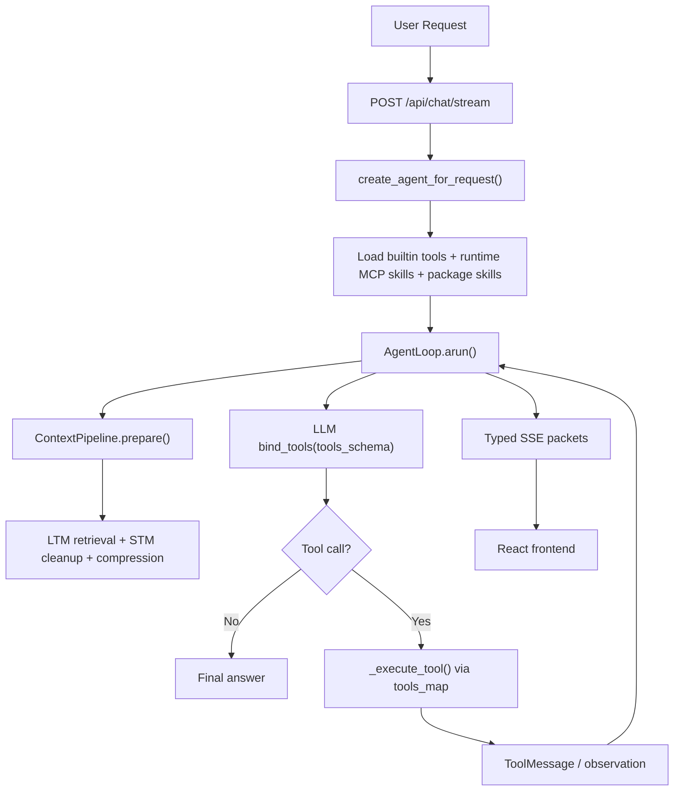
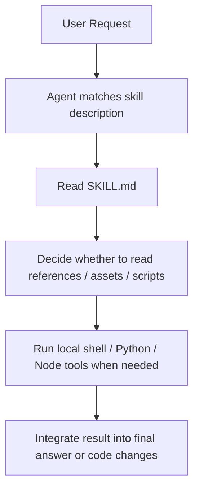
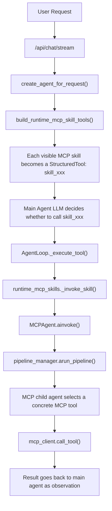
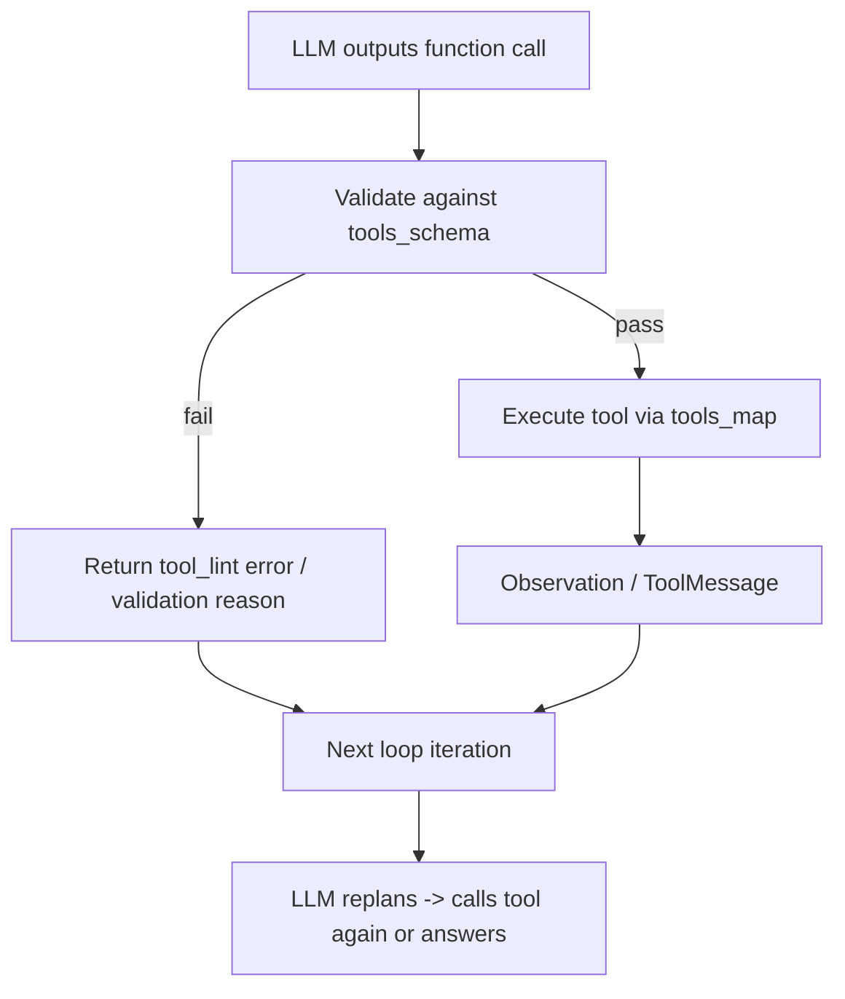
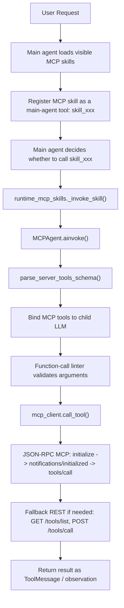

<div align="center">


<br/>

**EverLoop is an autonomous agent framework focused on one thing:**
**keeping the loop stable while the tool surface keeps growing.**

<br/>

[](https://python.org)
[](https://fastapi.tiangolo.com)
[](https://react.dev)
[](https://typescriptlang.org)
[](https://www.langchain.com/)
[](LICENSE)

<br/>

**Loop-first · Function-call guarded · Runtime MCP skills · Streaming observable**

</div>

---

## What is EverLoop?

EverLoop 是一个面向 **自主 Agent Runtime** 的工程化项目。它不是单纯“把 LLM 接上聊天框”，而是围绕一个可持续运行的 Agent loop，去解决这些真正会在复杂场景里出现的问题：

- **上下文会不会越跑越脏？**
- **工具调用参数错了怎么办？**
- **MCP 工具很多时，主 Agent 怎么保持稳定？**
- **Skill 怎么真正接入 Agent，而不是只停留在概念层？**
- **前端怎么把推理、校验、工具调用过程展示清楚？**

这个项目当前重点展示 4 个核心方向：

1. **Loop-first Agent Runtime**：围绕 `AgentLoop.arun()` 的多轮 while 循环。
2. **Function Calling Guardrails**：`tools_schema + tools_map + linter + retry loop`。
3. **Runtime MCP Skills**：把 MCP skill 作为主 Agent 的一个工具，而不是把所有 MCP tools 直接灌进全局池。
4. **Streaming Observability**：通过 SSE 把思考、校验、调用、返回结果实时推到前端。

> Status: actively evolving. The architecture is already demonstrable, while parts of the product surface are still being refined.

---

## Why this README is structured this way

如果要把项目放到 GitHub 上展示，这个 README 的目标不是“把所有代码都说一遍”，而是优先让别人快速看懂：

- 这个项目 **解决什么问题**
- 这个项目 **和普通聊天 Agent 有什么差异**
- 你的 **Skill / MCP / Function Calling 设计到底怎么落地**
- 前端页面 **长什么样、能看到什么**

---

## UI Showcase

> 当前我先帮你把 README 的展位和命名规范搭好。  
> `docs/screenshots/` 里放了占位图，你后续只需要把它们替换成真实截图即可。

<table>
  <tr>
    <td width="50%" valign="top">
      <strong>Login / Register</strong><br/>
      
    </td>
    <td width="50%" valign="top">
      <strong>Workspace / Chat</strong><br/>
      
    </td>
  </tr>
  <tr>
    <td width="50%" valign="top">
      <strong>Agents / Status View</strong><br/>
      
    </td>
    <td width="50%" valign="top">
      <strong>MCP Server Center</strong><br/>
      
    </td>
  </tr>
  <tr>
    <td width="50%" valign="top">
      <strong>Skill Workbench</strong><br/>
      
    </td>
    <td width="50%" valign="top">
      <strong>Trace / Tool Timeline</strong><br/>
      
    </td>
  </tr>
</table>

### Recommended screenshot checklist

- `login-page.*`：登录 / 注册页
- `workspace-page.*`：主对话区 + 输入框 + 输出区
- `agents-page.*`：左侧视图切换、状态面板、模型选择
- `mcp-page.*`：MCP server 列表、tools schema、工具调用区
- `skills-page.*`：skill 列表、开关、同步 / 创建 skill
- `trace-page.*`：SSE 状态流、tool cards、observation、usage

---

## Architecture at a Glance



---

## The Core Loop

EverLoop 的核心不是“有多少工具”，而是 **工具越来越多时，loop 还能不能稳定跑下去**。

`AgentLoop.arun()` 大致承担这些职责：

1. 准备上下文：STM / LTM / 环境信息 / 压缩后的消息
2. 让模型在 `tools_schema` 可见的前提下进行推理
3. 拿到 function call 后先做 **schema + 参数校验**
4. 成功则执行工具，失败则把错误回写到下一轮循环
5. 通过 observation / ToolMessage 把结果继续喂回 Agent
6. 直到得到最终回答或命中终止条件

这也是为什么 README 里后面重点展开的是：

- Skill 怎么接到这个 loop
- MCP 怎么接到这个 loop
- Function call 怎么在这个 loop 里被兜住

---

## Skill: from concept to runtime

### 1) Skill 的本质

Skill 接到 agent 里，本质上是把一组 **说明、文件、脚本、模板** 暴露给 agent，让 agent 在合适的时候自动加载并遵循。



### 2) 这个项目里 Skill 的展示重点

在 EverLoop 里，你可以把 Skill 理解成两种形态：

- **Package Skill**：本地打包能力，带 `SKILL.md`、文件、模板、脚本。
- **Runtime MCP Skill**：对主 Agent 来说，它表现为一个 `StructuredTool`；但内部会再启一个 MCP 子 Agent 去选具体 MCP tool。

这也是这个项目最适合展示的点之一：  
**“Skill 并不是一个静态提示词文件，而是 Agent 可调用的能力入口。”**

---

## How runtime MCP skills are wired into the main agent

下面这个流程基本就是你现在代码里的真实路径：



### Why this matters

这个设计和很多“把 MCP tools 直接合并进全局工具池”的方案不一样：

- **主 Agent 看到的是 skill 粒度**
- **子 Agent 看到的是具体 MCP tool 粒度**
- 这样可以把主 Agent 的工具面控制得更稳，更容易解释，也更适合展示“能力编排”

---

## Function Calling: how EverLoop does it

你这套 function call 设计，其实非常适合单独拿出来展示，因为它不只是“让 LLM 会调工具”，而是补了 **工程上的可靠性闭环**。

### `tools_schema` vs `tools_map`

在 `create_react_agent()` 里，工具会被拆成两个字段：

| Field | Role |
|---|---|
| `tools_schema` | 传给 LLM，让模型知道有哪些工具、每个工具叫什么、参数怎么传 |
| `tools_map` | 真正执行时的运行时映射：工具名 -> Python 函数 / coroutine |

所以可以很直白地理解为：

- `tools_schema` 解决 **“模型看见什么”**
- `tools_map` 解决 **“运行时到底调什么”**

### Linter validation

EverLoop 在执行 function call 前，会先走本地校验：

- 工具名是否存在
- 参数是否是 JSON object
- 必填参数是否缺失
- 参数类型是否匹配 schema
- 是否有额外非法参数
- 是否有可疑注入内容

这部分由 `function_calling/fc_validator.py` 负责，是一个 **机械校验层**，不是语义猜测层。

### Feedback loop

真正有价值的是：**校验失败不会直接把流程打死，而是会回到下一轮 loop。**



这意味着：

- 生成对了：进入下一轮继续推进任务
- 生成错了：也进入下一轮，但带着错误原因继续修正

前端也能把这件事展示出来，比如你提到的：

- `tool_lint error`
- 失败原因
- 下一轮重新规划 / 重新调用

这个展示效果会非常加分，因为别人能直观看到：
**你的 Agent 不是“碰到工具错误就停”，而是具备自修复闭环。**

---

## MCP in EverLoop

### The core design choice

EverLoop 里的 MCP 不是简单地把服务端 tools 全量暴露给主 Agent，而是采用：

> **MCP skill 作为主 Agent 的一个工具**  
> **MCP 子 Agent 再去选择具体 MCP tool**

这就是你这套设计最值得强调的差异点。



### MCP protocol behavior in this repo

在 EverLoop 里，主 Agent 或 MCP 子 Agent 扮演的是 **MCP Client**，远端能力提供方扮演 **MCP Server**。

运行过程大致是：

1. 连接 MCP Server
2. 获取工具列表（`tools/list`）
3. 转换为 LLM 可理解的 tool schema
4. 由模型选择工具并生成参数
5. 本地 linter 先做机械校验
6. 校验通过后再发起 `tools/call`
7. 结果标准化成 `observation / ToolMessage`
8. 写回 Agent loop，进入下一轮推理

### Transport compatibility

这个仓库做了两层兼容：

- **优先标准 JSON-RPC MCP**
  - `initialize`
  - `notifications/initialized`
  - `tools/list`
  - `tools/call`

- **不支持标准 MCP 时回退旧 REST**
  - `GET /tools/list`
  - `POST /tools/call`

这点很适合写进 README，因为它体现的是：
**你不只是“能接 MCP”，而是在做一个更稳的 MCP client adapter。**

---

## Streaming observability

前端展示不是附属品，而是这套系统的一部分。  
EverLoop 用 SSE 把 Agent loop 的关键阶段持续推给前端。

### Packet types

| Packet Type | Meaning |
|---|---|
| `think` | 流式思考文本 |
| `think_end` | 思考阶段结束 |
| `text` | 正式回答文本流 |
| `text_replace` | 用清洗后的文本替换当前回答 |
| `loop_status` | 当前 loop 阶段状态 |
| `tool_call_start` | 开始调用某个工具 |
| `tool_call_done` | 工具调用完成 |
| `observation` | 工具返回结果摘要 |
| `usage_update` | token / cost 更新 |
| `control` | 整个流的结束、错误、终止状态 |

### What the frontend can show

- Agent 当前处于哪一个阶段
- 是否在思考、是否在调用工具
- 调了哪个工具、参数是什么、结果摘要是什么
- MCP 调用是否成功
- 参数校验是否失败
- 当前 token / cost 统计

这会让你的 GitHub 展示不只是“有个聊天界面”，而是能体现：
**这是一个有运行时透明度的 Agent 平台。**

---

## Project structure

```text
EverLoop/
├── api/                    # FastAPI routes: chat / auth / mcp / skill
├── core/                   # Agent loop, context pipeline, streaming handler
├── memory/                 # STM / LTM / memory manager
├── function_calling/       # tool registry + schema validator
├── harness_framework/      # loop plugins / guards / linter / janitor
├── mcp_ecosystem/          # MCP client, server manager, pipeline, child agent
├── skill_system/           # package skills + runtime MCP skills
├── llm/                    # model factory / config
├── database/               # persistence models / CRUD / vector layer
├── frontend/               # React + TypeScript UI
├── init/                   # main agent assembly
└── main.py                 # app entry
```

---

## What this repo is especially good at demonstrating

如果你准备把它作为 GitHub 展示项目，我建议你把亮点聚焦在这 5 个关键词上：

1. **Agent Loop Runtime**
2. **Function Call Reliability**
3. **Runtime MCP Skill Orchestration**
4. **Context + Memory Management**
5. **Streaming Debuggability**

因为这 5 个词能把你的代码从“一个 AI demo”提升成“一个有 runtime design 的 agent system”。

---

## Quick start

### Backend

```bash
pip install -r requirements.txt
python main.py
```

Backend runs on:

```text
http://127.0.0.1:8001
```

### Frontend

```bash
cd frontend
npm install
npm run dev
```

Frontend runs on:

```text
http://localhost:5173
```

### Environment

Before running the project, make sure your root `.env` contains at least the LLM connection settings your runtime needs, for example:

```env
LLM_API_KEY=your_key
LLM_BASE_URL=your_base_url
LLM_MODEL_NAME=your_model
JWT_SECRET=your_secret
DATABASE_URL=sqlite+aiosqlite:///./everloop.db
```

---

## Suggested next README upgrades

如果你后面还想继续打磨 GitHub 展示，我建议下一步做这几件事：

- [ ] 把 `docs/screenshots/*.svg` 替换成真实页面截图
- [ ] 增加一张完整的“主 Agent / MCP 子 Agent / Tool 调用链路图”
- [ ] 补一个 30~60 秒 GIF，展示从提问到 tool trace 的完整流程
- [ ] 给 `Skill` 和 `MCP` 各补一个 end-to-end demo case
- [ ] 增加 “Why not direct global MCP tools?” 对比说明

---

## License

MIT License — see [LICENSE](LICENSE) for details.

---

<div align="center">
  <sub>If EverLoop helps you communicate agent runtime ideas more clearly, a ⭐ would mean a lot.</sub>
</div>
