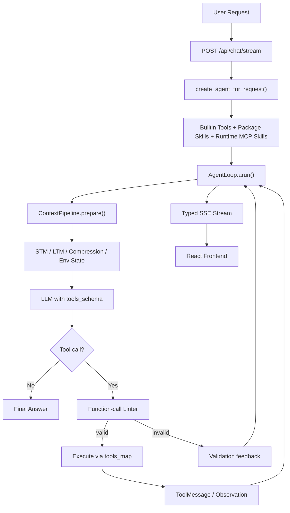
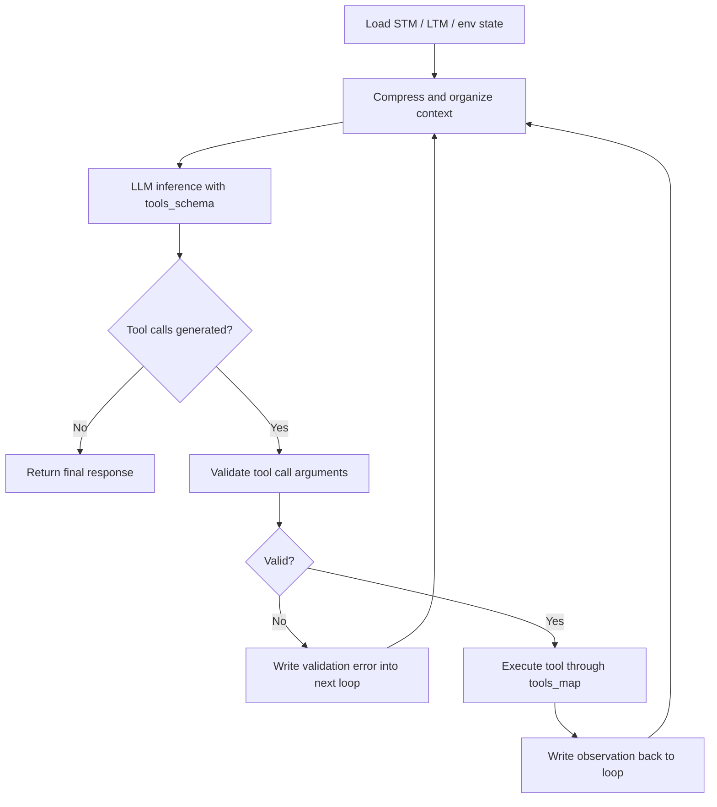
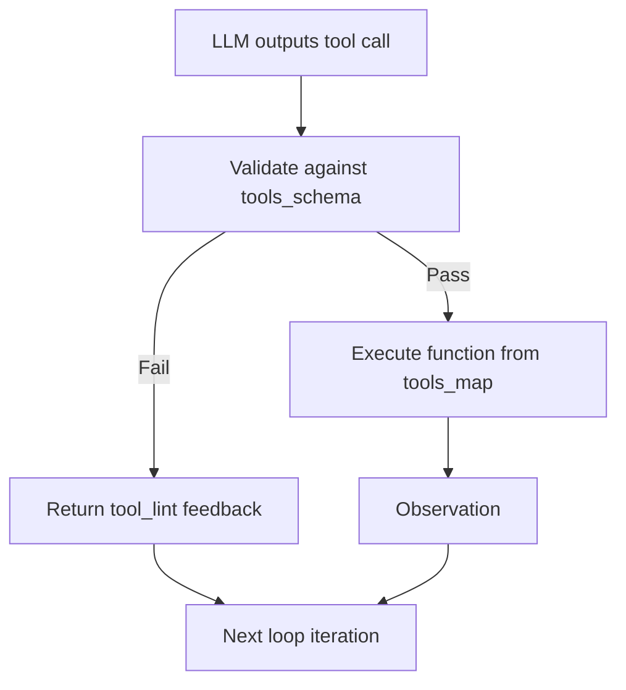
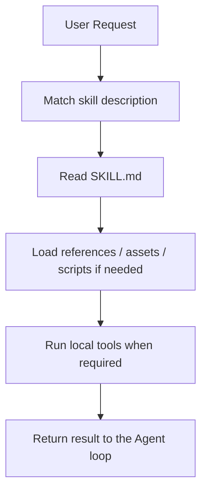
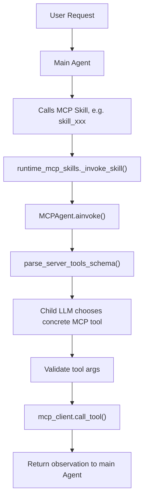

<div align="center">


<br/>

**A loop-first autonomous agent framework with MCP, Skills,**
**function-call validation, memory, and streaming runtime observability.**

<br/>

[](https://python.org)
[](https://fastapi.tiangolo.com)
[](https://react.dev)
[](https://typescriptlang.org)
[](https://www.langchain.com/)
[](LICENSE)

<br/>

**Agent Loop · MCP Runtime · Skill System · Function Calling · SSE Trace**

</div>

---

## Overview

EverLoop 是一个面向自主 Agent 的工程化运行框架。它围绕一个稳定的 Agent loop 构建，将上下文管理、工具调用、MCP 接入、Skill 编排、长期记忆和前端可观测性整合到同一套运行时中。

它关注的不是“让模型回复一句话”，而是让 Agent 在多轮推理、工具调用、参数修正和结果整合中持续稳定运行。

### Core Ideas

| Area | Description |
|---|---|
| Loop-first runtime | 以 `AgentLoop.arun()` 为核心，持续执行推理、校验、工具调用和 observation 写回 |
| Function-call guardrails | 使用 `tools_schema` 暴露工具接口，使用 `tools_map` 执行真实函数，并通过 linter 校验参数 |
| MCP as runtime skills | MCP skill 在主 Agent 中表现为一个工具，内部由 MCP 子 Agent 选择具体 MCP tool |
| Skill packaging | Skill 可以封装说明、文件、脚本、模板和领域工作流 |
| Streaming trace | 后端通过 SSE 推送思考、工具调用、校验结果、observation 和 token/cost 信息 |

---

## Showcase

### Workspace

主工作台提供对话入口、模型选择、状态面板和 Agent 运行视图。

<div align="center">
  
</div>

### MCP Center

MCP 页面用于管理 MCP Server、查看 tools schema，并将外部工具能力接入 Agent runtime。

<div align="center">
  
</div>

### Skill Workbench

Skill 页面用于管理可见能力包，并将 package skill 或 MCP skill 注册为 Agent 可调用能力。

<div align="center">
  
</div>

### Runtime Trace

Trace 页面展示 Agent loop 的实时状态，包括 SSE event、tool call、observation 和调用结果。

<div align="center">
  
</div>

---

## Architecture



---

## Agent Loop

EverLoop 的核心是一个持续运行的 Agent loop。每一轮都会经历上下文准备、模型推理、结果校验、工具执行和状态写回。



### Why the loop matters

As the tool surface grows, the main risk is not simply whether a model can call a tool once. The harder problem is keeping context, tool selection, validation, execution, and recovery predictable across many turns. EverLoop keeps these steps explicit inside the loop.

---

## Function Calling

EverLoop separates tool exposure from tool execution:

| Component | Role |
|---|---|
| `tools_schema` | Sent to the LLM. It describes available tools, names, descriptions, and parameter schemas |
| `tools_map` | Used by the runtime. It maps a selected tool name to the actual Python function or coroutine |
| `fc_validator.py` | Validates function calls before execution |

Before any tool is executed, EverLoop validates:

- whether the tool exists
- whether arguments are a JSON object
- whether required parameters are present
- whether argument types match the schema
- whether unexpected parameters are allowed
- whether suspicious injection-like content appears

If validation fails, the error is written back into the Agent loop. The model can then repair the call in the next iteration instead of failing silently.



---

## Skill System

A Skill is a packaged capability that can expose instructions, files, scripts, templates, and workflow-specific context to an Agent.



EverLoop supports two main skill styles:

| Skill Type | Description |
|---|---|
| Package Skill | A local capability package with files, templates, scripts, and `SKILL.md` |
| Runtime MCP Skill | A skill backed by an MCP Server, registered as a main-agent tool |

---

## MCP Runtime

EverLoop treats MCP as a client-server protocol for external tools. The Agent or MCP child Agent acts as the MCP Client; the external capability provider acts as the MCP Server.

The design is intentionally layered:



This keeps the main Agent's tool surface smaller. The main Agent chooses the skill-level capability, while the MCP child Agent chooses the concrete server-side tool.

### MCP Transport

EverLoop first tries standard JSON-RPC MCP:

- `initialize`
- `notifications/initialized`
- `tools/list`
- `tools/call`

For compatibility with older servers, it can fall back to REST-style endpoints:

- `GET /tools/list`
- `POST /tools/call`

---

## Streaming Observability

EverLoop streams typed SSE packets to the frontend so the runtime can be inspected while it is running.

| Packet Type | Meaning |
|---|---|
| `think` | Streams model thinking content into the UI |
| `think_end` | Marks the end of a thinking block |
| `text` | Streams final answer text |
| `text_replace` | Replaces already-streamed text after cleanup |
| `loop_status` | Reports the current runtime phase |
| `tool_call_start` | Reports that a tool call has started |
| `tool_call_done` | Reports tool completion and result preview |
| `observation` | Sends the normalized tool observation |
| `usage_update` | Reports token and estimated cost usage |
| `control` | Reports stream completion, abort, or error |

---

## Project Structure

```text
EverLoop/
├── api/                    # FastAPI routes: chat, auth, MCP, skill
├── core/                   # Agent loop, context pipeline, streaming handler
├── database/               # SQLAlchemy models, CRUD, persistence
├── function_calling/       # Tool registry and function-call validation
├── harness_framework/      # Runtime plugins, guards, cleanup daemons
├── init/                   # Agent assembly and runtime initialization
├── llm/                    # Model factory and provider configuration
├── mcp_ecosystem/          # MCP client, server manager, child Agent pipeline
├── memory/                 # Short-term and long-term memory layers
├── skill_system/           # Package skills and runtime MCP skills
├── frontend/               # React + TypeScript UI
├── scripts/                # Startup and health-check helpers
└── main.py                 # FastAPI application entrypoint
```

---

## Quick Start

### Backend

```bash
pip install -r requirements.txt
python main.py
```

Backend runs at:

```text
http://127.0.0.1:8001
```

### Frontend

```bash
cd frontend
npm install
npm run dev
```

Frontend runs at:

```text
http://localhost:5173
```

### Environment

Configure the LLM endpoint and runtime settings in `.env`:

```env
LLM_API_KEY=your_key
LLM_BASE_URL=your_base_url
LLM_MODEL_NAME=your_model
JWT_SECRET=your_secret
DATABASE_URL=sqlite+aiosqlite:///./everloop.db
```

---

## Tech Stack

| Layer | Stack |
|---|---|
| Backend | Python, FastAPI, LangChain, SQLAlchemy |
| Frontend | React, TypeScript, Vite, Zustand |
| Agent Runtime | Custom AgentLoop, function-call validator, MCP child Agent |
| Memory | STM, LTM, vector-store-ready retrieval |
| Streaming | Server-Sent Events with typed packets |

---

## License

MIT License. See [LICENSE](LICENSE) for details.

<br/>

<div align="center">
  <sub>Built for agent systems that need to keep thinking, calling tools, and recovering in the same loop.</sub>
</div>
