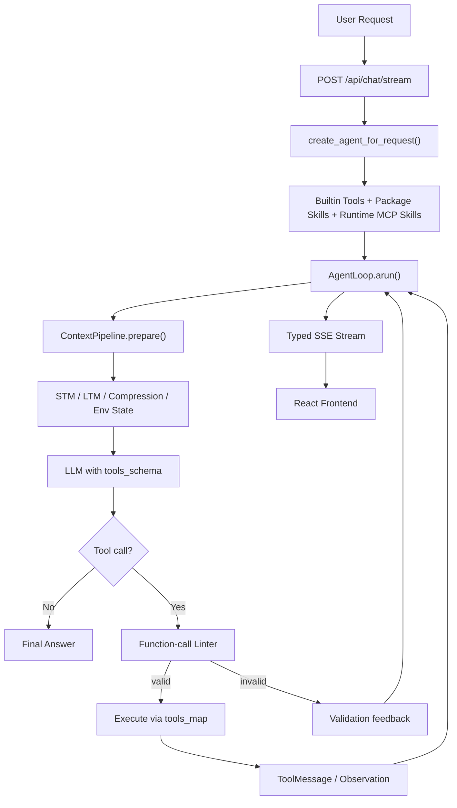
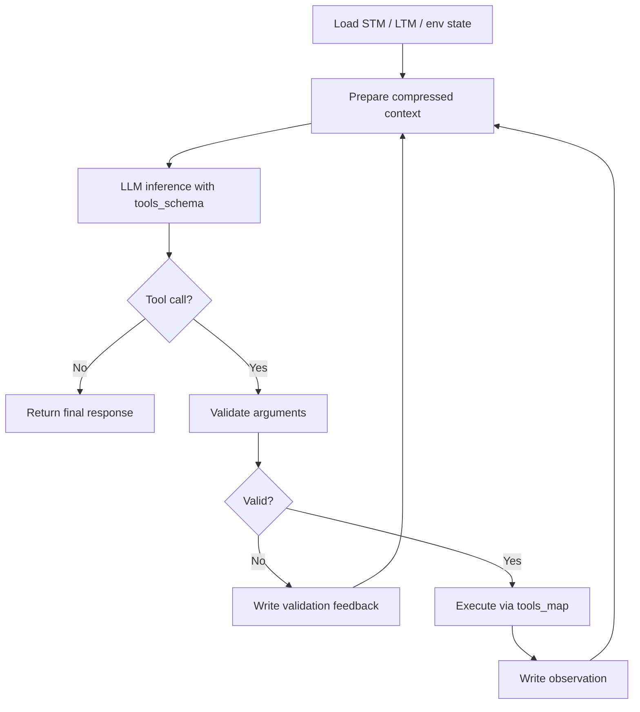
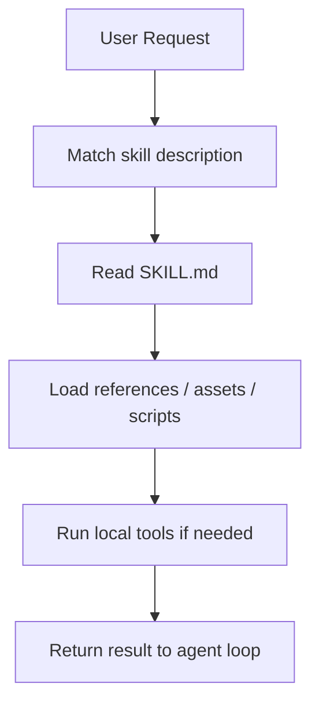
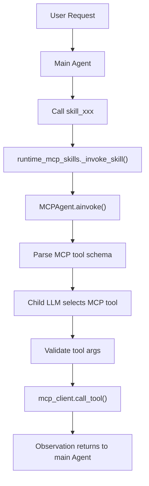

<div align="center">


<br/>

**A loop-first autonomous agent framework with MCP, Skills,**
**function-call validation, memory, and streaming runtime observability.**

<br/>

[](https://python.org)
[](https://fastapi.tiangolo.com)
[](https://react.dev)
[](https://typescriptlang.org)
[](https://www.langchain.com/)

<br/>

**Agent Loop | MCP Runtime | Skill System | Function Calling | SSE Trace**

</div>

---

## Overview

EverLoop is an engineering-focused runtime for autonomous agents. It combines a stable agent loop, context management, tool execution, MCP integration, skill orchestration, memory, and frontend runtime tracing in one project.

The core goal is to keep an agent reliable across multi-turn reasoning, tool calls, argument repair, and result synthesis.

## Highlights

| Area | What EverLoop provides |
|---|---|
| Agent loop | A reusable `AgentLoop.arun()` runtime for inference, validation, tool execution, and observation write-back |
| Function calling | Separate `tools_schema` for the LLM and `tools_map` for runtime execution |
| Tool validation | Local schema validation before executing model-generated tool calls |
| MCP runtime | MCP Servers can be exposed as high-level runtime skills |
| Skill system | Skills can package instructions, files, templates, scripts, and domain workflows |
| Streaming trace | SSE events expose thinking, tool calls, observations, usage, and runtime status to the UI |

---

## Showcase

### Workspace

The workspace combines chat, model selection, runtime status, and the main agent interaction surface.

<div align="center">
  
</div>

### MCP Center

The MCP center manages MCP Servers, inspects tool schemas, and connects external tool providers to the agent runtime.

<div align="center">
  
</div>

### Skill Workbench

The skill workbench manages package skills and MCP-backed skills that can be registered as agent-callable capabilities.

<div align="center">
  
</div>

### Runtime Trace

The trace view shows loop status, tool calls, observations, and streamed runtime events.

<div align="center">
  
</div>

---

## Quick Start

EverLoop is started through the project startup script:

```bash
sh start.sh
```

The script starts the backend and frontend together.

Default URLs:

```text
Frontend: http://localhost:5173
Backend:  http://127.0.0.1:8001
API docs: http://127.0.0.1:8001/docs
```

### Requirements

- Conda
- Python 3.10+
- Node.js 18+
- An OpenAI-compatible LLM endpoint

By default, the startup script expects a conda environment named `agent`.

Create it if needed:

```bash
conda create -n agent python=3.11
```

Use a different conda environment:

```bash
EVERLOOP_CONDA_ENV=my-env sh start.sh
```

Skip the startup LLM health check:

```bash
EVERLOOP_CHECK_LLM=0 sh start.sh
```

---

## Configuration

EverLoop reads model configuration from `.env`.

Example:

```env
DEFAULT_MODEL=qwen3-32b
LLM_ENDPOINT__qwen3-32b=https://your-openai-compatible-endpoint/v1/chat/completions
LLM_API_KEY__qwen3-32b=your_api_key

JWT_SECRET_KEY=change-this-secret
DATABASE_URL=sqlite+aiosqlite:///./everloop.db
```

Model names are dynamic. For each model, define:

```text
LLM_ENDPOINT__<model_name>
LLM_API_KEY__<model_name>
```

Then set:

```text
DEFAULT_MODEL=<model_name>
```

Useful startup variables:

| Variable | Default | Purpose |
|---|---:|---|
| `EVERLOOP_CONDA_ENV` | `agent` | Conda environment used by `start.sh` |
| `EVERLOOP_BACKEND_HOST` | `127.0.0.1` | Backend host |
| `EVERLOOP_BACKEND_PORT` | `8001` | Preferred backend port |
| `EVERLOOP_BACKEND_WAIT_SECONDS` | `120` | Backend readiness timeout |
| `EVERLOOP_CHECK_LLM` | `1` | Set to `0` to skip LLM health check |
| `EVERLOOP_STARTUP_CLEANUP` | `1` | Set to `0` to skip startup cleanup |

---

## Architecture



---

## Agent Loop

EverLoop keeps the core agent lifecycle explicit:



This makes tool selection, validation, execution, and recovery visible and controllable instead of hidden inside a single model response.

---

## Function Calling

EverLoop separates what the model can see from what the runtime executes.

| Component | Role |
|---|---|
| `tools_schema` | Tool definitions sent to the LLM |
| `tools_map` | Runtime mapping from tool name to Python function or coroutine |
| `fc_validator.py` | Local validation layer before execution |

The validator checks tool existence, JSON object shape, required fields, argument types, extra parameters, and suspicious injection-like content. Invalid calls are written back into the next loop iteration as feedback.

---

## Skill System

A Skill is a packaged capability that can expose instructions, files, scripts, templates, and workflow-specific context to an agent.



EverLoop supports:

| Skill Type | Description |
|---|---|
| Package Skill | Local capability package with files, templates, scripts, and `SKILL.md` |
| Runtime MCP Skill | MCP-backed skill registered as a main-agent tool |

---

## MCP Runtime

EverLoop uses MCP as a client-server protocol for external tools. The main agent can call an MCP skill, and a child MCP agent can select the concrete tool exposed by the MCP Server.



EverLoop first tries JSON-RPC MCP:

- `initialize`
- `notifications/initialized`
- `tools/list`
- `tools/call`

It can also fall back to REST-style endpoints:

- `GET /tools/list`
- `POST /tools/call`

---

## Streaming Observability

The backend streams typed SSE packets so the UI can show what the runtime is doing.

| Packet Type | Meaning |
|---|---|
| `think` | Thinking stream |
| `think_end` | End of thinking block |
| `text` | Final answer stream |
| `text_replace` | Replace streamed text after cleanup |
| `loop_status` | Runtime phase status |
| `tool_call_start` | Tool call started |
| `tool_call_done` | Tool call finished |
| `observation` | Normalized tool result |
| `usage_update` | Token and cost update |
| `control` | Stream lifecycle event |

---

## Project Structure

```text
EverLoop/
|-- api/                 FastAPI routes: chat, auth, MCP, skill
|-- core/                Agent loop, context pipeline, streaming handler
|-- database/            SQLAlchemy models, CRUD, persistence
|-- function_calling/    Tool registry and function-call validation
|-- harness_framework/   Runtime plugins, guards, cleanup daemons
|-- init/                Agent assembly and runtime initialization
|-- llm/                 Model factory and provider configuration
|-- mcp_ecosystem/       MCP client, server manager, child-agent pipeline
|-- memory/              Short-term and long-term memory layers
|-- skill_system/        Package skills and runtime MCP skills
|-- frontend/            React + TypeScript UI
|-- scripts/             Startup and health-check helpers
`-- main.py              FastAPI application entrypoint
```

---

## Tech Stack

| Layer | Stack |
|---|---|
| Backend | Python, FastAPI, LangChain, SQLAlchemy |
| Frontend | React, TypeScript, Vite, Zustand |
| Agent Runtime | Custom AgentLoop, function-call validator, MCP child agent |
| Memory | STM, LTM, vector-store-ready retrieval |
| Streaming | Server-Sent Events with typed packets |

---

<div align="center">
  <sub>Built for agent systems that need to keep thinking, calling tools, and recovering in the same loop.</sub>
</div>
