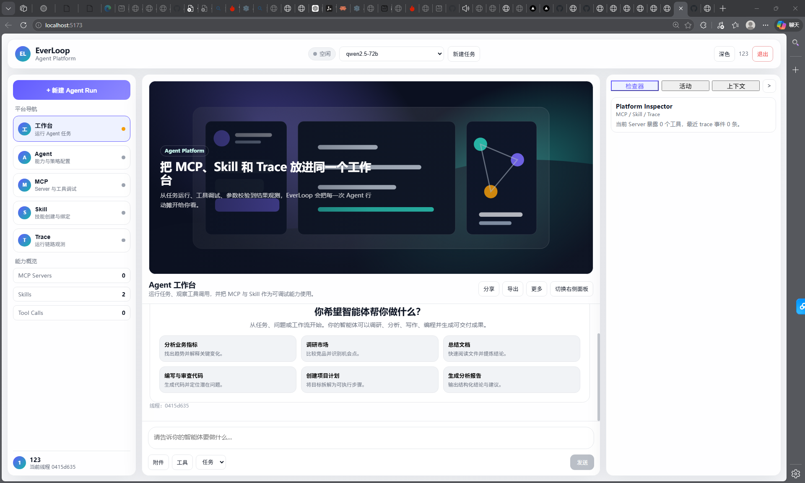
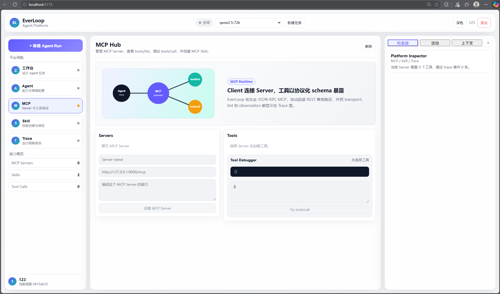
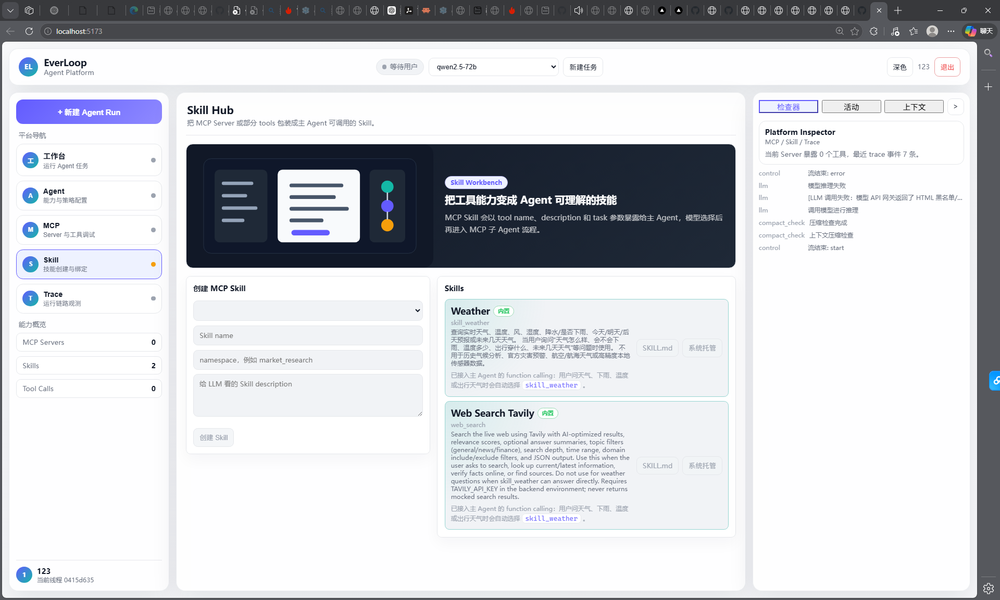
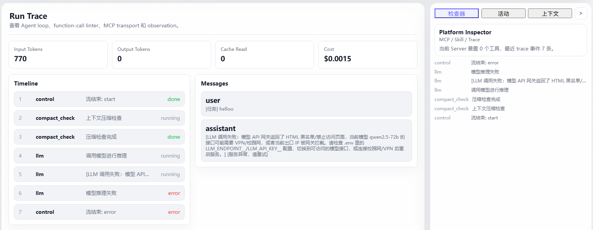
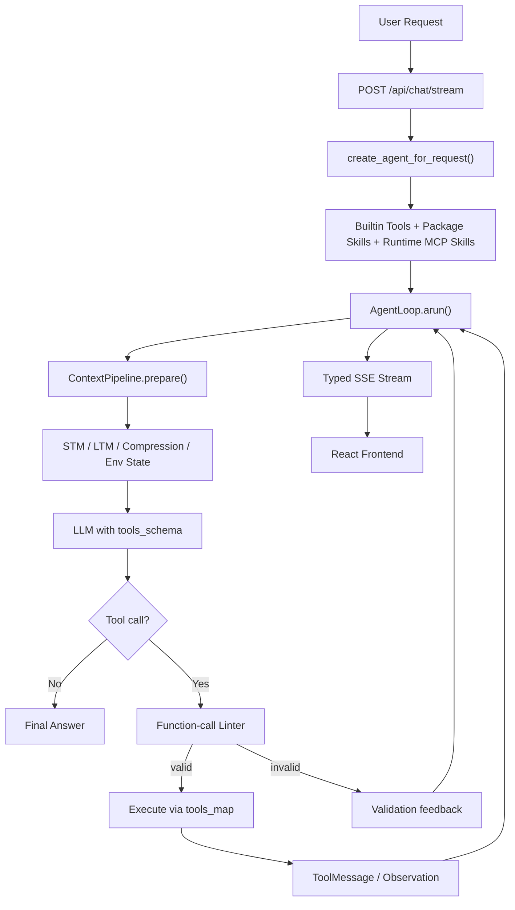
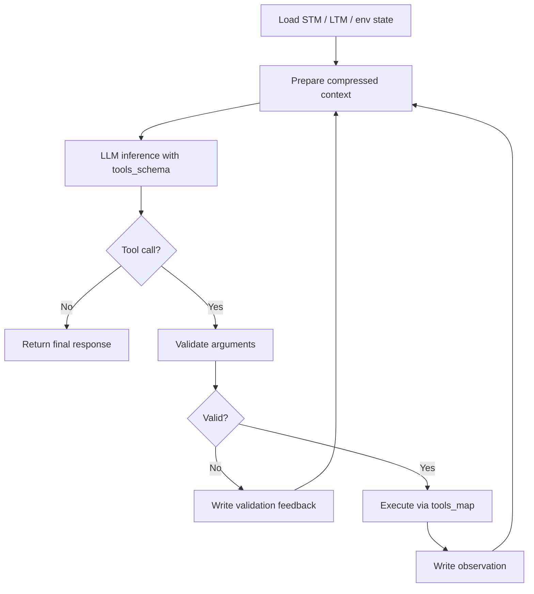
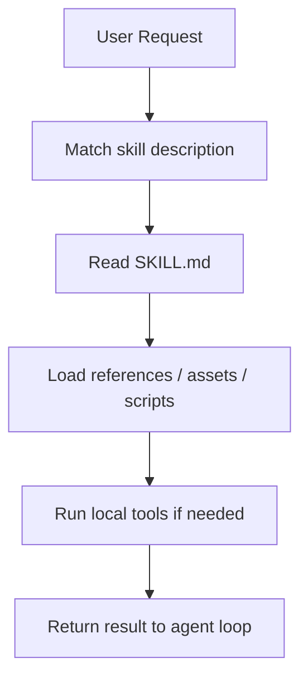
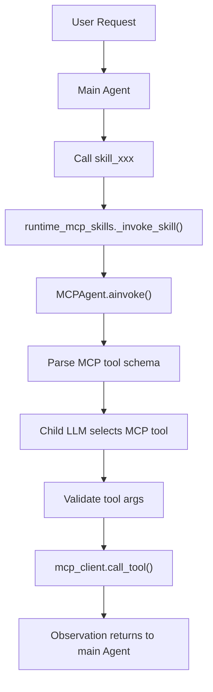

<div align="center">


<br/>

**一个以 Agent Loop 为核心的自主 Agent 运行框架，集成 MCP、Skill、函数调用校验、记忆系统与流式运行时追踪。**

<br/>

[](https://python.org)
[](https://fastapi.tiangolo.com)
[](https://react.dev)
[](https://typescriptlang.org)
[](https://www.langchain.com/)

<br/>

**Agent Loop | MCP Runtime | Skill System | Function Calling | SSE Trace**

</div>

---

## 项目概览

EverLoop 是一个面向自主 Agent 的工程化运行框架。它不是简单的聊天壳，而是围绕一个稳定的 `AgentLoop`，把上下文管理、工具执行、MCP 接入、Skill 编排、记忆系统和前端运行时追踪整合到同一套架构中。

它关注的核心问题是：Agent 在多轮推理、工具调用、参数修正和结果整合过程中，如何保持稳定、可控、可观察。

## 核心能力

| Area | 说明 |
|---|---|
| Agent Loop | 以 `AgentLoop.arun()` 为核心，把推理、校验、工具执行和 observation 写回放进同一个循环 |
| Function Calling | `tools_schema` 给 LLM 看，`tools_map` 给 runtime 执行，避免“模型看到什么”和“系统执行什么”混在一起 |
| Tool Validation | 在真正执行工具前，通过本地 linter 校验工具名、参数类型、必填字段和可疑内容 |
| MCP Runtime | MCP Server 可以被封装成主 Agent 可调用的 runtime skill |
| Skill System | Skill 可以封装说明、文件、模板、脚本和领域工作流 |
| Streaming Trace | 通过 SSE 将 thinking、tool call、observation、usage 和 runtime status 实时推送到前端 |

---

## 界面展示

### Workspace

主工作台集成了对话入口、模型选择、运行状态面板和主 Agent 交互区域，是用户发起任务和观察 Agent 运行过程的核心界面。

<div align="center">
  
</div>

### MCP Center

MCP 管理中心用于注册和管理 MCP Server，查看服务端暴露的 tools schema，并将外部工具能力接入 EverLoop runtime。

<div align="center">
  
</div>

### Skill Workbench

Skill 工作台用于管理本地能力包和 MCP-backed Skill。对主 Agent 来说，Skill 是一个可调用能力入口；在内部运行时中，它可以继续加载文件、脚本、模板，或调用 MCP 子 Agent。

<div align="center">
  
</div>

### Runtime Trace

Trace 视图展示 Agent loop 的实时状态，包括 SSE event、tool call、observation、工具结果和运行阶段，方便调试复杂任务中的每一步。

<div align="center">
  
</div>

---

## 快速启动

EverLoop 推荐通过启动脚本一键运行，脚本会同时启动后端和前端：

```bash
sh start.sh
```

默认地址：

```text
Frontend: http://localhost:5173
Backend:  http://127.0.0.1:8001
API docs: http://127.0.0.1:8001/docs
```

### 环境要求

- Conda
- Python 3.10+
- Node.js 18+
- OpenAI-compatible LLM endpoint

默认情况下，`start.sh` 会使用名为 `agent` 的 conda 环境。

如需创建环境：

```bash
conda create -n agent python=3.11
```

使用其他 conda 环境：

```bash
EVERLOOP_CONDA_ENV=my-env sh start.sh
```

跳过启动时的 LLM 健康检查：

```bash
EVERLOOP_CHECK_LLM=0 sh start.sh
```

---

## 配置

EverLoop 会从 `.env` 中读取模型、鉴权和数据库配置。

```env
DEFAULT_MODEL=qwen3-32b
LLM_ENDPOINT__qwen3-32b=https://your-openai-compatible-endpoint/v1/chat/completions
LLM_API_KEY__qwen3-32b=your_api_key

JWT_SECRET_KEY=change-this-secret
DATABASE_URL=sqlite+aiosqlite:///./everloop.db
```

模型名是动态的。每个模型需要配置一组 endpoint 和 API key：

```text
LLM_ENDPOINT__<model_name>
LLM_API_KEY__<model_name>
```

然后设置默认模型：

```text
DEFAULT_MODEL=<model_name>
```

常用启动变量：

| Variable | Default | 说明 |
|---|---:|---|
| `EVERLOOP_CONDA_ENV` | `agent` | 启动脚本使用的 conda 环境 |
| `EVERLOOP_BACKEND_HOST` | `127.0.0.1` | 后端监听地址 |
| `EVERLOOP_BACKEND_PORT` | `8001` | 后端默认端口 |
| `EVERLOOP_BACKEND_WAIT_SECONDS` | `120` | 等待后端就绪的最大时间 |
| `EVERLOOP_CHECK_LLM` | `1` | 设为 `0` 可跳过 LLM 健康检查 |
| `EVERLOOP_STARTUP_CLEANUP` | `1` | 设为 `0` 可跳过启动清理 |

---

## Architecture



---

## Agent Loop

EverLoop 将 Agent 的核心生命周期显式拆开：上下文准备、模型推理、工具校验、工具执行、结果写回和下一轮推理都在 loop 中清晰发生。



这种设计让工具选择、参数校验、执行结果和错误恢复都可见、可控，而不是隐藏在一次模型回复里。

---

## Function Calling

EverLoop 将“模型看到的工具定义”和“运行时真正执行的函数”分离。

| Component | 说明 |
|---|---|
| `tools_schema` | 传给 LLM 的工具 schema，包括名称、描述和参数结构 |
| `tools_map` | runtime 工具映射，负责把工具名映射到实际 Python function 或 coroutine |
| `fc_validator.py` | 工具执行前的本地校验层 |

`fc_validator.py` 会检查工具是否存在、参数是否是 JSON object、必填字段是否缺失、类型是否匹配、是否有多余参数，以及是否包含可疑注入内容。校验失败时，错误会作为反馈写回下一轮 Agent loop，让模型有机会修正调用。

---

## Skill System

Skill 是一种能力包，可以向 Agent 暴露说明、文件、脚本、模板和特定领域的 workflow context。



EverLoop 支持两类 Skill：

| Skill Type | 说明 |
|---|---|
| Package Skill | 本地能力包，适合封装固定工作流、文档模板和脚本 |
| Runtime MCP Skill | 基于 MCP Server 的动态 Skill，对主 Agent 表现为一个可调用工具 |

---

## MCP Runtime

EverLoop 将 MCP 作为外部工具的 client-server protocol。主 Agent 调用 MCP Skill，MCP 子 Agent 再根据具体任务选择 MCP Server 暴露的真实工具。



优先使用标准 JSON-RPC MCP：

- `initialize`
- `notifications/initialized`
- `tools/list`
- `tools/call`

同时兼容旧 REST 风格接口：

- `GET /tools/list`
- `POST /tools/call`

---

## Streaming Observability

后端通过 typed SSE packet 将运行时事件推送到前端，让用户能够看到 Agent 正在思考、调用工具、接收 observation 或进入某个 loop 阶段。

| Packet Type | 说明 |
|---|---|
| `think` | 思考内容流 |
| `think_end` | 思考阶段结束 |
| `text` | 最终回答文本流 |
| `text_replace` | 清理后替换已流式输出的文本 |
| `loop_status` | 当前运行阶段 |
| `tool_call_start` | 工具调用开始 |
| `tool_call_done` | 工具调用完成 |
| `observation` | 标准化工具返回结果 |
| `usage_update` | token 与费用估算更新 |
| `control` | 流式生命周期事件 |

---

## Project Structure

```text
EverLoop/
|-- api/                 FastAPI routes: chat, auth, MCP, skill
|-- core/                Agent loop, context pipeline, streaming handler
|-- database/            SQLAlchemy models, CRUD, persistence
|-- function_calling/    Tool registry and function-call validation
|-- harness_framework/   Runtime plugins, guards, cleanup daemons
|-- init/                Agent assembly and runtime initialization
|-- llm/                 Model factory and provider configuration
|-- mcp_ecosystem/       MCP client, server manager, child-agent pipeline
|-- memory/              Short-term and long-term memory layers
|-- skill_system/        Package skills and runtime MCP skills
|-- frontend/            React + TypeScript UI
|-- scripts/             Startup and health-check helpers
`-- main.py              FastAPI application entrypoint
```

---

## Tech Stack

| Layer | Stack |
|---|---|
| Backend | Python, FastAPI, LangChain, SQLAlchemy |
| Frontend | React, TypeScript, Vite, Zustand |
| Agent Runtime | Custom AgentLoop, function-call validator, MCP child agent |
| Memory | STM, LTM, vector-store-ready retrieval |
| Streaming | Server-Sent Events with typed packets |

---

<div align="center">
  <sub>Built for agent systems that need to keep thinking, calling tools, and recovering in the same loop.</sub>
</div>
